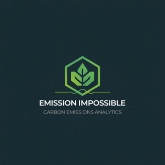

# Team_2_Emission_Impossible

CarbonIQ: A web‑based carbon modelling tool (Java Spring) to show customers potential decarbonisation.

<!-- Template Source: https://github.com/othneildrew/Best-README-Template -->

<a id="readme-top"></a>

<!-- PROJECT LOGO -->
<br />
<div align="center">
  <a href="https://github.com/lfcourtney/Team_2_Emission_Impossible">
    
  </a>

<h3 align="center">CarbonIQ</h3>

  <p align="center">
    A web‑based carbon modelling tool (Java Spring) to show customers potential decarbonisation.
  </p>
</div>

<!-- TABLE OF CONTENTS -->
<details>
  <summary>Table of Contents</summary>
  <ol>
    <li>
      <a href="#about-the-project">About The Project</a>
      <ul>
        <li><a href="#built-with">Built With</a></li>
        <li>
        <a href="#system-design-document">System Design Document</a>
            <ul>
            <li><a href="#entity-relationship-diagram-erd">Entity-relationship diagram (ERD)</a></li>
            <li><a href="#pestle-analysis">PESTLE Analysis</a></li>
            <li><a href="#vmost-analysis">VMOST Analysis</a></li>
            <li><a href="#risk-matrix">Risk Matrix</a></li>
            <li><a href="#risk-register">Risk Register</a></li>
            <li><a href="#skills-matrix">Skills Matrix</a></li>
            <li><a href="#user-personas">User Personas</a></li>
            <li><a href="#user-stories">User Stories</a></li>
            <li><a href="#work-breakdown-structure-wbs">Work Breakdown Structure (WBS)</a></li>
            <li><a href="#swimlane-diagram-aka-activity-diagram">Swimlane Diagram</a></li>
            <li><a href="#uml-class-diagram">UML Class Diagram</a></li>
            <li><a href="#code-coverage">Spring Boot Backend Code Coverage</a></li>
            </ul>
        </li>
      </ul>
    </li>
    <li>
      <a href="#getting-started">Getting Started</a>
      <ul>
        <!-- <li><a href="#prerequisites">Prerequisites</a></li> -->
        <li><a href="#installation">Installation</a></li>
      </ul>
    </li>
    <li><a href="#roadmap">Roadmap</a></li>
    <li><a href="#contributors">Contributors</a></li>
  </ol>
</details>

<!-- ABOUT THE PROJECT -->

## About The Project


<p align="right">(<a href="#readme-top">back to top</a>)</p>

### Built With

- 
- 
- 
- 
- 

<p align="right">(<a href="#readme-top">back to top</a>)</p>

### System Design Document

System Design Document (SDD) outlines specifications used to build the system; a high-level overview of the system architecture; and data design of the system.

<p align="right">(<a href="#readme-top">back to top</a>)</p>

#### Entity-relationship diagram (ERD)


<p align="right">(<a href="#readme-top">back to top</a>)</p>

#### PESTLE Analysis


<p align="right">(<a href="#readme-top">back to top</a>)</p>

#### VMOST Analysis


<p align="right">(<a href="#readme-top">back to top</a>)</p>

#### Risk Matrix


<p align="right">(<a href="#readme-top">back to top</a>)</p>

#### Risk Register


<p align="right">(<a href="#readme-top">back to top</a>)</p>

#### Skills Matrix


<p align="right">(<a href="#readme-top">back to top</a>)</p>

#### User Personas


<p align="right">(<a href="#readme-top">back to top</a>)</p>

#### User Stories


<p align="right">(<a href="#readme-top">back to top</a>)</p>

#### Work Breakdown Structure (WBS)


<p align="right">(<a href="#readme-top">back to top</a>)</p>

#### Swimlane Diagram (aka Activity Diagram)


<p align="right">(<a href="#readme-top">back to top</a>)</p>

#### UML Class Diagram


<p align="right">(<a href="#readme-top">back to top</a>)</p>

#### Code Coverage

[Spring Boot Backend Code Coverage](/backend/htmlReport__code-coverage/index.html "backend\\htmlReport__code-coverage\\index.html")

<p align="right">(<a href="#readme-top">back to top</a>)</p>

<!-- GETTING STARTED -->

## Getting Started

1. Ensure `carbon-iq` database exists. In a localhost instance of MySQL:

```
DROP DATABASE IF EXISTS `carbon-iq`;

CREATE DATABASE `carbon-iq`;
```

### Installation

- Frontend Vite React Project

1. Change directory `cd` to `./frontend`
2. Install dependencies: `npm install`
3. Start development server: `npm run dev`

<p align="right">(<a href="#readme-top">back to top</a>)</p>

## Roadmap

- [ ] System Design Document (SDD)
  - [x] Database Design ie, Entity-relationship diagram (ERD)
  - [x] PEST analysis; possible VMOST and SWOT analysis too
  - [x] Prototype Design, eg, wireframe
  - [x] Risk Matrix
  - [x] Risk Register
  - [x] Skills matrix
  - [x] User stories; at least 3 personas
  - [x] Work Breakdown Structure (WBS)
  - [x] Swim-lane diagram (or UML activity diagram)
  - [x] UML class diagram
  - [ ] Gantt chart (alternatively burnup or burndown chart)
  - [ ] Consider technical debts. Need to mention this in presentation.
- [x] Set up Sprint Boot project

<p align="right">(<a href="#readme-top">back to top</a>)</p>

<!-- Contributors -->

## Contributors

**Team 2, Emission Impossible**

- [Aaron Bhangu](https://github.com/AXB1501-dev)
- [Alex Price](https://github.com/KiwiFunk)
- [Luke Courtney](https://github.com/lfcourtney)
- [Sinead Sadler](https://github.com/YogicCoder888)
- [Yasmin Hassan](https://github.com/YasminH-24)

<p align="right">(<a href="#readme-top">back to top</a>)</p>
